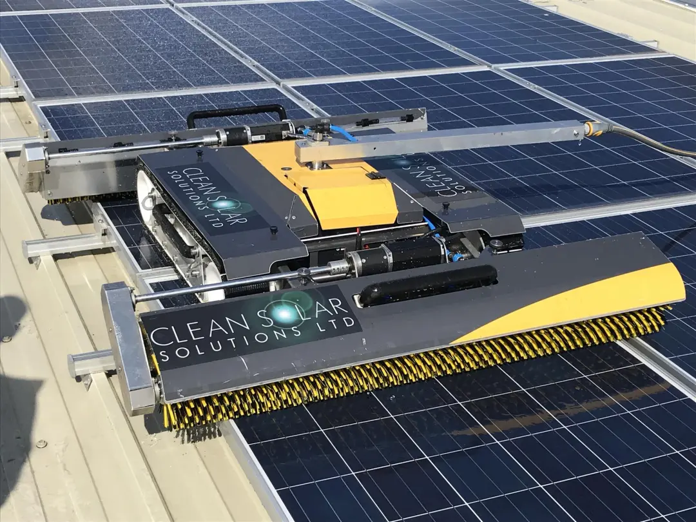
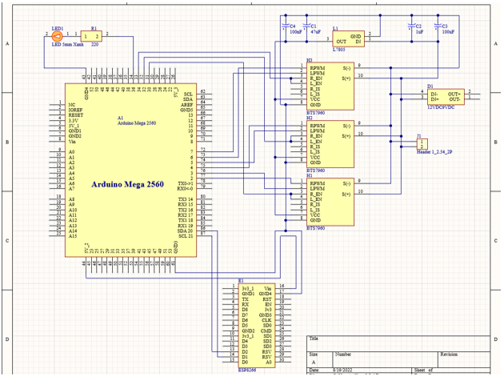
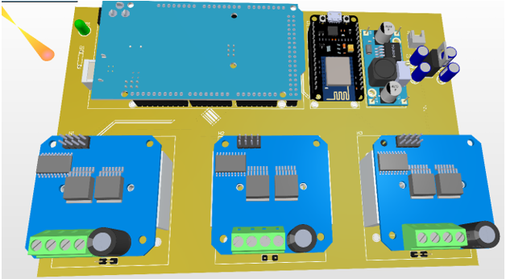
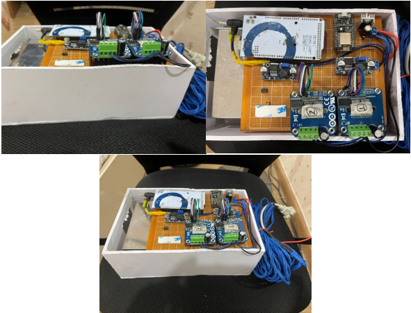
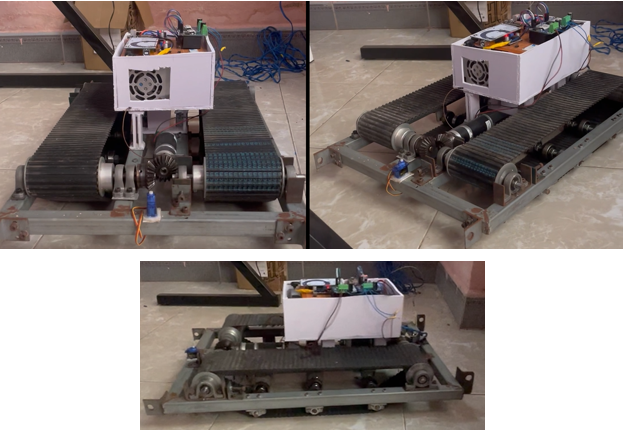
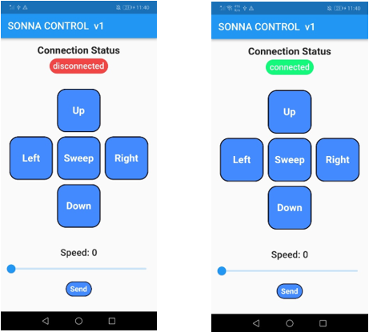

# INTRODUCE
Design hardware to control the Sona robot used to clean solar panels.

***
# HARDWARE 
#### List of main devices
- **Arduino Mega2560**: to control engine by bridge ciruit H.
- **Esp8266**: to receive the signal from the controller and transmit the signal to the Arduino.
- **BTS7960**: bridge ciruit H.
#### Using "Altium Designer" to make a circuit

- Source link: [schematic file][1]

#### Result    

Actual image (the circuit here is just the lower layer wiring circuit, not the PCB circuit as designed above).

***
# SOFTWARE 
**APP**: Using Flutter language

|Button|Function|
|---|------------------------|
|Up|Robot goes forward|
|Down|Robot goes backwards|
|Left|Robot goes left|
|Right|Robot goes right|
|Sweep|Robot cleans up|
|connected/disconnected|to connect as well as notify the connection status between the phone and the robot|
|Send|send the speed of the robot down from the phone (the speed is adjusted by the slide bar)|
- Source link: [flutter file][2]
***
**Detailed report**: [link][3]

[1]: <...>
[2]: <...>
[3]: <...>
